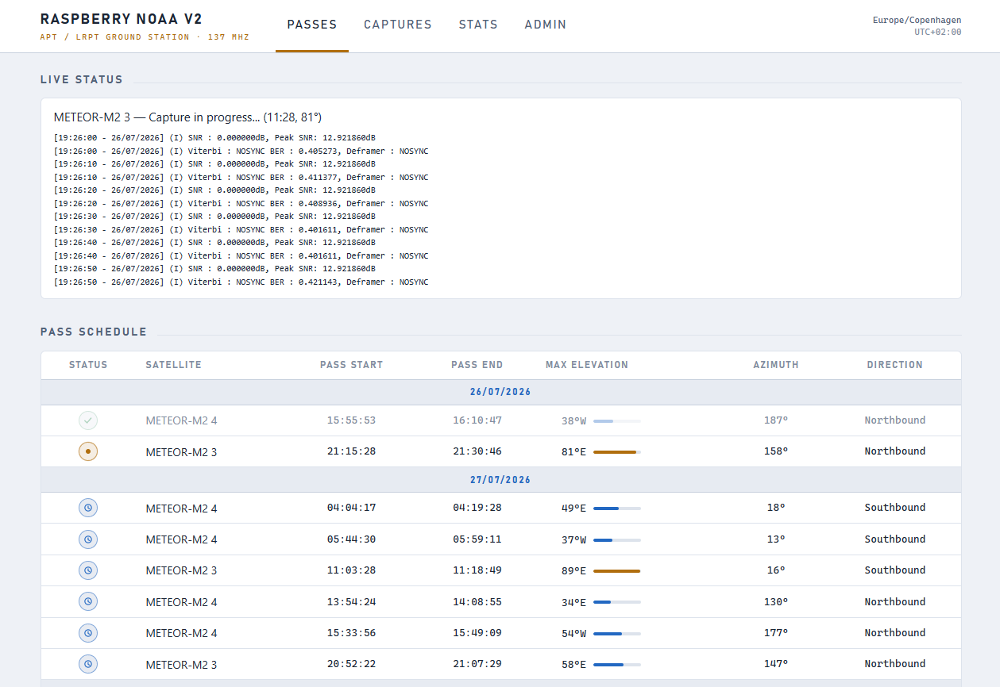

A complete, self-hosted ground station for receiving, decoding, and sharing **NOAA APT** and **Meteor-M LRPT** weather satellite imagery — running on a Raspberry Pi or any x64 Debian PC with a cheap software-defined radio.

One command installs everything. After that, the station runs itself: it predicts passes, schedules captures, decodes images with [SatDump](https://github.com/SatDump/SatDump), publishes them to a built-in web panel, and (optionally) pushes them to your favorite social/chat platforms.


*The webpanel's passes page during a live Meteor-M2 3 capture: real-time SatDump decoder status in the banner, and the upcoming pass schedule below. More screenshots [here](docs/webpanel_screenshots.md).*

Looking for support, wanting to talk about new features, or just hanging out? Come chat with us on [Discord](https://discord.gg/A9w68pqBuc)!

> _This project is a spinoff of the original [raspberry-noaa](https://github.com/reynico/raspberry-noaa) created by Nico, who graciously permitted this major refactor to push the project forward. All original history and credit is preserved — see [Credits](#credits)._

---

## Table of contents

- [How it works](#how-it-works)
- [Features](#features)
- [Supported satellites](#supported-satellites)
- [Hardware requirements](#hardware-requirements)
- [Software requirements](#software-requirements)
- [Getting started](#getting-started)
  - [Option 1: prebuilt images](#option-1-prebuilt-images)
  - [Option 2: install from source](#option-2-install-from-source)
- [The webpanel](#the-webpanel)
- [JSON API and RSS feed](#json-api-and-rss-feed)
- [Sharing your captures](#sharing-your-captures)
- [Station health watchdog](#station-health-watchdog)
- [Housekeeping](#housekeeping)
- [Changing settings after install](#changing-settings-after-install)
- [Upgrading](#upgrading)
- [Troubleshooting](#troubleshooting)
- [Migrating from the original raspberry-noaa](#migrating-from-the-original-raspberry-noaa)
- [Documentation index](#documentation-index)
- [Credits](#credits)
- [Contributing](#contributing)

## How it works

Once installed, the station runs a fully automated capture pipeline:

1. **Predict** — every night (and at boot), a cron job downloads fresh TLEs from Celestrak and computes upcoming passes for every enabled satellite using a native Python (ephem) predictor.
2. **Schedule** — each pass becomes an `at` job. When two passes overlap, the station automatically keeps the better one (configurable — it can also prefer Meteor over NOAA, or leave the decision to you).
3. **Capture and decode** — at pass time, SatDump records and decodes the signal live. If enough free RAM is available, intermediate audio/CADU data is kept in ramfs to spare your SD card.
4. **Post-process** — images are normalized, enhanced (dozens of false-color and thermal composites), annotated with map overlays, and complemented with polar pass plots and thumbnails. Per-pass signal quality (SNR) is recorded.
5. **Publish** — everything lands in the webpanel gallery, the JSON API, and the RSS feed, and can be pushed automatically to a dozen social/chat platforms.

Everything is stored in a local SQLite database and served by nginx + PHP on the device itself — no cloud services required.

## Features

**Capture and decoding**
- SatDump live decoding for both NOAA APT and Meteor-M LRPT (including the Meteor 80k interleaved mode)
- Per-satellite tuning: gain, PPM frequency offset, bias-tee power, minimum pass elevation, minimum sun elevation (day/night control), and SDR device assignment
- Multiple SDRs supported simultaneously — assign a different device to each satellite
- Automatic resolution of overlapping passes, with optional Meteor-over-NOAA priority
- RAM-based recording (ramfs) when memory allows, reducing SD card wear
- Per-pass signal quality metrics (peak/average SNR) stored and displayed

**Image processing**
- Full set of SatDump enhancements for NOAA (MSA, MCIR, precipitation variants, HVC/HVCT, thermal, sea-surface temperature, and many more) with separate day and night enhancement lists
- Meteor composites including 221/321 visible, 654 night, thermal, MCIR, 3.9 µm shortwave IR, and optional fire-detection
- Optional equirectangular (map-projected) versions of Meteor composites — geographically aligned, which also enables daily timelapse animation
- Country border map overlays, thermal temperature scale overlay (position configurable), image cropping, Meteor image flipping, and configurable JPEG quality
- Polar plots of each pass (azimuth/elevation and direction graphs) and thumbnails for the gallery

**Webpanel** (mobile friendly, light/dark mode, 17 languages)
- Pass schedule with a live "capture in progress" status banner
- Capture gallery with filtering, per-pass image pages, and progressive JPEGs for fast loading
- Station statistics page: capture counts, reception-quality sky map (see where your antenna hears best), and the latest daily timelapse
- Admin page for managing scheduled passes (optionally password-protected)
- Optional extras on the passes page: Satvis orbit visualization, solar terminator day/night map, coronal mass ejection activity display
- Optional TLS (HTTPS) with Let's Encrypt support

**Integrations and sharing**
- Push each capture to: Discord, Telegram, Matrix, Slack, Pushover, Mastodon, Bluesky, Twitter/X, Facebook, Instagram, or email
- Generic JSON webhook for home automation (Home Assistant, n8n, Node-RED, …)
- Push quality gate — only share passes above a minimum elevation and/or SNR, so weak captures stay off your feeds
- Daily "best of day" summary post, optionally with an animated Meteor timelapse GIF
- Read-only JSON API and RSS 2.0 feed for external dashboards and feed readers
- Optional contribution of your captures to community-built worldwide composites

**Operations**
- One command (`./install_and_upgrade.sh`) for both install and every subsequent configuration change or upgrade
- Station health watchdog — hourly self-check that alerts you (via your enabled push channels) when captures stop succeeding, disk fills up, scheduling breaks, or the SDR disappears from USB
- Automatic pruning of old images and audio, database backup tooling
- Verification tool to smoke-test an installation, extensive logging

## Supported satellites

| Satellite | Downlink | Mode |
| --- | --- | --- |
| NOAA 15 | 137.6200 MHz | APT |
| NOAA 18 | 137.9125 MHz | APT |
| NOAA 19 | 137.1000 MHz | APT |
| Meteor-M N2-3 | 137.9000 MHz | LRPT |
| Meteor-M N2-4 | 137.9000 MHz | LRPT |

Each satellite is individually enabled in `config/settings.yml` and individually tunable (gain, elevations, SDR device, bias tee, frequency offset).

## Hardware requirements

**Computer** — one of:
- Raspberry Pi 3, 4, or 5 (any variant of these models), running 64-bit Raspberry Pi OS (Trixie)
- Any x64 PC running a 64-bit Debian Trixie based distribution

A Pi 3 works, but faster hardware helps with the first-time SatDump source build and with image processing. A desktop environment is fine but unnecessary — the minimal ("Lite") OS images are recommended so the GUI doesn't compete for CPU during a capture.

**SDR receiver** — set `receiver_type` in `config/settings.yml` to match:

| `receiver_type` | Device |
| --- | --- |
| `rtlsdr` | RTL-SDR dongles, including the RTL-SDR Blog V4 (rtl-sdr is built from source for V4 support) |
| `airspy_mini` | Airspy Mini |
| `airspy_r2` | Airspy R2 |
| `airspy_hf_plus_discovery` | Airspy HF+ Discovery |
| `hackrf` | HackRF |
| `sdrplay` | SDRplay devices (the proprietary API installer is bundled) |
| `mirisdr` | MiriSDR-based devices |

Multiple SDRs of the same type can be told apart by device ID (see [docs/setting_sdr_source_id.md](docs/setting_sdr_source_id.md)).

**Antenna** — anything that receives 137 MHz right-hand circular polarized signals works: a V-dipole, QFH, or turnstile. For one of the cheapest ways to get started (rabbit-ears-as-dipole), see [this guide](https://jekhokie.github.io/noaa/satellite/rf/antenna/sdr/2019/05/31/noaa-satellite-imagery-sdr.html). An LNA (e.g. Sawbird+ NOAA) noticeably improves results and can be powered via the bias-tee settings.

For historical hardware compatibility notes, see [docs/hardware.md](docs/hardware.md).

## Software requirements

**Only 64-bit Debian Trixie (13) based systems are supported** — the installer refuses to run on anything else. That means:

- 64-bit Raspberry Pi OS based on Trixie, or
- any 64-bit Debian Trixie based distro on a PC (desktop environment doesn't matter).

Other requirements, all handled during setup:
- The repository must be cloned to the home directory (`~/raspberry-noaa-v2`) of a **normal user with sudo privileges** — never run the installer as root.
- `git` must be installed to clone the repository.
- SatDump is built from source during the first install (upstream provides no Trixie package), so **expect the first install on a Raspberry Pi to take quite a while**. Subsequent runs skip it.

## Getting started

### Option 1: prebuilt images

Community members maintain ready-to-flash Raspberry Pi images — a great way to get running quickly (they may lag behind the latest code):

- **VE3ELB**: [https://qsl.net/ve3elb/RaspiNOAA/](https://qsl.net/ve3elb/RaspiNOAA/) (setup instructions in the included PDF)
- **Jochen Köster DC9DD**: [https://www.qsl.net/do3mla/raspberry-pi-images.html](https://www.qsl.net/do3mla/raspberry-pi-images.html) — the base of [this off-grid station in Northern Norway](https://usradioguy.com/science/off-grid-apt-lrpt-satellite-ground-station/)
- **MihajloPi**: [Google Drive folder](https://drive.google.com/drive/folders/1acaZ78VEROc7BWVtJ82C6qVrccA9CkR6) — minimal, general-user oriented

### Option 2: install from source

Fresh OS? Do the basics first (on a Pi, `sudo raspi-config` to set locale/timezone/WiFi country):

```bash
# bring the system up to date, then reboot
sudo apt update
sudo apt full-upgrade -y
sudo reboot

# install git
sudo apt install git -y
```

Then clone, configure, and install:

```bash
# clone the repository into your home directory (the expected location)
cd $HOME
git clone --depth 1 https://github.com/jekhokie/raspberry-noaa-v2.git
cd raspberry-noaa-v2/

# create your settings file from the template and edit it: at minimum set
# your latitude/longitude/altitude, enable the satellites you want, and
# set your receiver_type and gain
cp config/settings.yml.example config/settings.yml
nano config/settings.yml

# run the installer (as your normal user - NOT root/sudo; you will be
# asked for your sudo password along the way)
./install_and_upgrade.sh
```

The installer validates your settings, then uses Ansible to install and configure everything: SatDump (built from source on first run — be patient), rtl-sdr, nginx + PHP webpanel, the Python environment, cron jobs, udev rules, and the database. When it finishes, passes are already scheduled.

**That's it.** Open `http://<ip-of-your-device>/` in a browser to see the webpanel, and wait for the first pass. Capture activity is logged to `/var/log/raspberry-noaa-v2/output.log`.

If you enabled TLS and/or the admin page lock, see [docs/tls_webserver.md](docs/tls_webserver.md) for certificate and login details.

## The webpanel

The webpanel (see [screenshots](docs/webpanel_screenshots.md)) is served directly from the device and is mobile friendly, with light and dark modes and translations for 17 languages (`lang_setting`: ar, bg, cn, de, en, es, fr, gr, hu, it, kr, lt, nl, pt, ro, ru, sr).

- **Passes** — upcoming pass schedule with a live banner while a capture/decode is in progress. Optional extras: Satvis satellite tracking visualization, a solar terminator world map, and a coronal mass ejection activity display.
- **Captures** — filterable gallery of every decoded pass; each capture page shows all enhancement images, the polar pass plots, and signal quality.
- **Stats** — station statistics, a reception-quality sky map built from your pass history (spot obstructions and antenna blind spots), and the most recent daily timelapse.
- **Admin** — manage scheduled passes; can be locked behind a username/password (`lock_admin_page` — only do this on a TLS-enabled site, credentials over plain HTTP can be intercepted).

## JSON API and RSS feed

The webpanel exposes a small, read-only, unauthenticated JSON API plus an RSS feed — useful for external dashboards, home automation, and feed readers ([full documentation](docs/api.md)):

| Endpoint | Returns |
| --- | --- |
| `GET /api/passes` | upcoming scheduled passes |
| `GET /api/captures?limit=N` | latest decoded captures (default 20, max 100) |
| `GET /api/capture?id=N` | one capture with all enhancement image URLs |
| `GET /api/status` | the pass being captured right now (if any) and the next one |
| `GET /api/rss` | RSS 2.0 feed of the latest captures with thumbnails |

## Sharing your captures

Every completed capture can be pushed automatically to any combination of:

| Channel | Docs / notes |
| --- | --- |
| Discord | [docs/discord_push.md](docs/discord_push.md) |
| Telegram | [docs/telegram_push.md](docs/telegram_push.md) |
| Matrix | [docs/matrix_push.md](docs/matrix_push.md) |
| Slack | webhook-based |
| Pushover | mobile push notifications |
| Mastodon | — |
| Bluesky | — |
| Twitter/X | [docs/twitter_push.md](docs/twitter_push.md) |
| Facebook | [docs/facebook_push.md](docs/facebook_push.md) |
| Instagram | [docs/instagram_push.md](docs/instagram_push.md) |
| Email | [docs/emailing.md](docs/emailing.md) (requires `~/.msmtprc`) |
| Generic webhook | [docs/webhook_push.md](docs/webhook_push.md) — JSON POST per capture, for Home Assistant, n8n, Node-RED, … |

Two features keep your feeds high quality:

- **Push quality gate** (`enable_push_quality_gate`) — skip pushing weak passes below a minimum elevation and/or SNR. Everything is still decoded and shown in the webpanel; only the social push is skipped (the generic webhook always fires).
- **Best-of-day summary** ([docs/best_of_day.md](docs/best_of_day.md)) — an evening cron job posts the single best capture of the day (ranked by SNR, then elevation). With `enable_daily_timelapse`, it also builds an animated GIF from the day's map-projected Meteor passes and attaches it.

You can also opt in to contributing captures to community-built worldwide composites (`contribute_to_community_composites` — no personal data is collected).

## Station health watchdog

An unattended ground station fails silently — the watchdog ([docs/health_watchdog.md](docs/health_watchdog.md)) makes it fail loudly instead. An hourly self-check alerts you through your enabled text-capable push channels (Telegram, Discord, Pushover, Slack, webhook) when:

- no capture has succeeded for a configurable number of hours (default 48),
- every recent pass attempt is failing,
- the image disk is nearly full (default threshold 90%),
- the scheduling queue is empty (broken TLE download or scheduler), or
- the RTL-SDR has disappeared from USB.

Each alert repeats at most once per 24 hours while the condition persists. Enabled by default (`enable_health_watchdog`).

## Housekeeping

- **Image pruning** ([docs/pruning.md](docs/pruning.md)) — delete the oldest N captures per run and/or everything older than N days (`delete_oldest_n`, `delete_older_than_n`); old timelapse GIFs are pruned too.
- **Audio cleanup** — recordings can be deleted immediately after decoding (`delete_noaa_audio` / `delete_meteor_audio`) or automatically after a few days (`delete_files_older_than_days`).
- **Database backups** ([docs/db_backups.md](docs/db_backups.md)) — back up the SQLite `panel.db` on a schedule.

## Changing settings after install

`config/settings.yml` is the single configuration file for everything — station location, satellites, SDR, image processing, webpanel, and integrations. To change anything:

```bash
nano config/settings.yml
./install_and_upgrade.sh
```

The script re-applies the entire configuration; there is nothing else to edit. (`settings.yml` is not tracked by git, so your configuration never conflicts with updates.)

Two settings-related notes:
- If you *lower* `days_to_schedule_passes`, wipe the already-scheduled future jobs afterwards: `./scripts/schedule.sh -x`
- To re-schedule passes manually at any time with fresh TLEs: `./scripts/schedule.sh -t`

## Upgrading

```bash
cd ~/raspberry-noaa-v2
git pull
./install_and_upgrade.sh
```

After upgrading, compare your `config/settings.yml` with `config/settings.yml.example` — settings are occasionally added or retired. Leftover retired keys are harmless, but new features may need their new keys copied over.

**Switching branches** without losing settings and images (e.g. to try a development branch):

```bash
${HOME}/.rn2_utils/rn2_upgrade.sh https://github.com/jekhokie/raspberry-noaa-v2.git -b <branch-name>
```

## Troubleshooting

1. **Check the log**: `/var/log/raspberry-noaa-v2/output.log` records every capture event, including errors.
2. **Run the verification tool** (~1 minute) — checks permissions, packages, and does dry runs of nginx and a 1-second SatDump capture:
   ```bash
   ~/raspberry-noaa-v2/scripts/tools/verification_tool/verification.sh
   ```
3. **Read the [troubleshooting guide](docs/troubleshooting.md)** for blank/noisy image issues and other common problems.
4. **Ask for help** on [Discord](https://discord.gg/A9w68pqBuc), or open a GitHub issue. You can also email MihajloPi at mihajlo.raspberrypi@gmail.com — include the log so the errors can be debugged.

## Migrating from the original raspberry-noaa

Coming from Nico's original raspberry-noaa? A few commands migrate your station and keep all your existing captures visible — see the [migration document](docs/migrate_from_raspberry_noaa.md).

Upgrading a device from an older RN2/OS version? Only Debian Trixie is supported now: back up `db/panel.db` and the `/srv` directory, reinstall the OS fresh, restore those paths, then install as usual.

## Documentation index

| Document | Topic |
| --- | --- |
| [docs/api.md](docs/api.md) | JSON API and RSS feed |
| [docs/best_of_day.md](docs/best_of_day.md) | Daily best-capture summary push and timelapse |
| [docs/db_backups.md](docs/db_backups.md) | Database backups |
| [docs/discord_push.md](docs/discord_push.md) | Discord integration |
| [docs/emailing.md](docs/emailing.md) | Emailing images (IFTTT) |
| [docs/facebook_push.md](docs/facebook_push.md) | Facebook integration |
| [docs/hardware.md](docs/hardware.md) | Historical hardware compatibility notes |
| [docs/health_watchdog.md](docs/health_watchdog.md) | Station health watchdog |
| [docs/instagram_push.md](docs/instagram_push.md) | Instagram integration |
| [docs/matrix_push.md](docs/matrix_push.md) | Matrix integration |
| [docs/meteor.md](docs/meteor.md) | Meteor-M full decoding details |
| [docs/migrate_from_raspberry_noaa.md](docs/migrate_from_raspberry_noaa.md) | Migrating from the original raspberry-noaa |
| [docs/pruning.md](docs/pruning.md) | Pruning old images |
| [docs/setting_sdr_source_id.md](docs/setting_sdr_source_id.md) | Multiple SDR device IDs |
| [docs/telegram_push.md](docs/telegram_push.md) | Telegram integration |
| [docs/tls_webserver.md](docs/tls_webserver.md) | TLS/HTTPS and admin login |
| [docs/troubleshooting.md](docs/troubleshooting.md) | Troubleshooting captures and images |
| [docs/twitter_push.md](docs/twitter_push.md) | Twitter/X integration |
| [docs/webhook_push.md](docs/webhook_push.md) | Generic webhook integration |
| [docs/webpanel_screenshots.md](docs/webpanel_screenshots.md) | Webpanel screenshots |

## Credits

The NOAA/METEOR image capture community is a group of fantastic, experienced engineers, radio operators, and tinkerers that all contributed in some way, shape, or form to the success of this repository/framework. Below are some direct contributions and call-outs to the significant efforts made:

* **[haslettj](https://www.instructables.com/member/haslettj/)**: Did the hard initial work and created the post to instruct on how to build the base of this framework.
    * [Instructables](https://www.instructables.com/id/Raspberry-Pi-NOAA-Weather-Satellite-Receiver/) post had much of the content needed to kick this work off.
* **[Nico Rey](https://github.com/reynico)**: Initial creator of the [raspberry-noaa](https://github.com/reynico/raspberry-noaa) starting point for this repository.
* **[otti-soft](https://github.com/otti-soft/meteor-m2-lrpt)**: Meteor-M 2 python functionality for image processing.
* **[NateDN10](https://www.instructables.com/member/NateDN10/)**: Came up with the major enhancements to the Meteor-M 2 receiver image processing in "otti-soft"s repo above.
    * [Instructables](https://www.instructables.com/Raspberry-Pi-NOAA-and-Meteor-M-2-Receiver/) post had the details behind creating the advanced functionality.
* **[Dom Robinson](https://github.com/dom-robinson)**: Meteor enhancements, Satvis visualizations, and overall great code written that were incorporated into the repo.
    * Merge of functionality into this repo was partially created using his excellent fork of the original raspberry-noaa repo [here](https://github.com/dom-robinson/raspberry-noaa).
    * Continued pushing the boundaries on the framework capabilities.
* **[Colin Kaminski](https://www.facebook.com/holography)**: MAJOR testing assistance and submission of various enhancements and documentation.
    * Continuous assistance of community members in their search for perfect imagery.
* **[Mohamed Anjum Abdullah](https://www.facebook.com/MohamedAnjum9694/)**: Initial testing of the first release.
* **[Kyle Keen](http://kmkeen.com/rtl-power/)**: Programming a lot of features for our RTL-SDR Drivers.
* **[Pascal P.](https://github.com/Cirromulus)**: Frequency/spectrum analysis test scripts for visualizing the frequency spectrum of the environment.
* **[Socowi's Time Functionality](https://stackoverflow.com/a/50434292)**: Time parser to calculate end date for scanner scripts.
* **[Vince VE3ELB](https://github.com/ve3elb)**: Took on the invaluable task of creating fully working images of RN2 for the PI and maintains [https://qsl.net/ve3elb/RaspiNOAA/](https://qsl.net/ve3elb/RaspiNOAA/).
* **[mihajlo2003petkovic/MihajloPi](https://github.com/mihajlo2003petkovic)**: Integrated MeteorDemod for Meteor decoding and building it via Ansible, and also the awesome SatDump (option satdump_live) for both NOAA and Meteor live decoding. Shrunk and optimised both NOAA and Meteor receive scripts by quite much! Implemented Facebook and Instagram posting scripts and fixed Twitter posting script due to the API 2.0 error. Made the localisation option redundant (automatically handled by the computer itself). Provided support for Airspy, HackRF and SDRPlay devices. Implemented website compression, edited the website landing page and improved the perceived image loading speed by using progressive JPEGs. Created [image](https://drive.google.com/drive/folders/1acaZ78VEROc7BWVtJ82C6qVrccA9CkR6) with Gary Day's help. Removed RTL-FM and GNU Radio and simplified workflow by quite a lot using exclusively SatDump for recording and demodulating signals live to wav/S files, then processing them later with WXtoImg or SatDump for NOAA, and MeteorDemod or SatDump for Meteor.
* **[Silvio I6CBI](https://www.qrz.com/db/I6CBI)**: General testing on Pi and PC running LMDE 5, helped debug WKHTMLTOPDF and integrate SDR Play devices for GNU Radio. Tested MiriSDR.
* **[Nicolas Delestre](https://twitter.com/DELESTRENicola2?t=NHkKPKWMsVQaeNv9vutYMA&s=09)**: General testing on Pi and PC running LMDE 5, lending his Pi and PC to MihajloPi virtually over SSH, VMC and TeamViewer for testing.
* **[Gary Day](https://www.facebook.com/profile.php?id=100068381156913&mibextid=ZbWKwL)**: Helped by lending his Raspberry Pis virtually over SSH, VNC and TeamViewer to MihajloPi for testing and creating an image.
* **[Jérôme jp112sdl](https://github.com/jp112sdl)**: Implemented automatic discarding of Meteor M2-3 night passes since they give no visible image when it's in RGB123 mode.
* **[patrice7560](https://meteo-schaltin.duckdns.org)**: Beta tester, helped in detecting and reporting errors ASAP for debugging.
* **[Richard AI4Y](https://www.qrz.com/db/AI4Y)**: Provided Debian 12 (Bookworm) support for Raspberry Pi, 64-bit Raspberry OS support, discovered the FFMPEG bug when creating spectrograms, solved atrm errors on the website, and several NTP and timezone issues in PHP, developed Verification Tool, Developed In-Situ Upgrade for switching repo's/branches, developed RN2 Utilities for backup/restore/stage, uninstall and upgrading, general warning cleanup of scripts, Made 32-bit wxtoimg run on 64-bit Debian, creates satdump/predict DEB files for armhf & arm64, general alpha and beta testing.

## Contributing

Pull requests are welcome! Simply follow the below pattern:

1. Fork the repository to your own GitHub account.
2. `git clone` your forked repository.
3. `git checkout -b <my-branch-name>` to create a branch.
4. Do some awesome feature development or bug fixes, committing to the branch regularly.
5. `git push origin <my-branch-name>` to push your branch to your forked repository.
6. Head back to the upstream `jekhokie/raspberry-noaa-v2` repository and submit a pull request using your branch from your forked repository.
7. Provide really good details on the development you've done within the branch, and answer any questions asked/address feedback.
8. Profit when you see your pull request merged to the upstream master and used by the community!

Keep your fork's master in sync with upstream to make merge conflicts easier down the road.

Happy coding (and receiving)!
